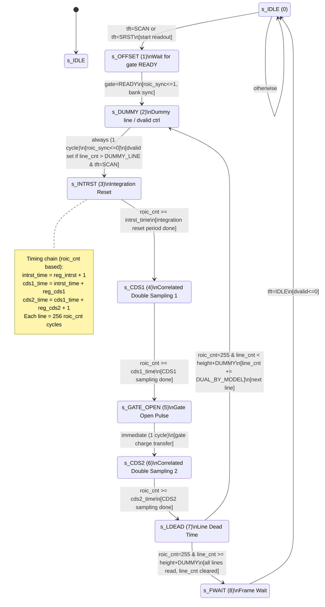
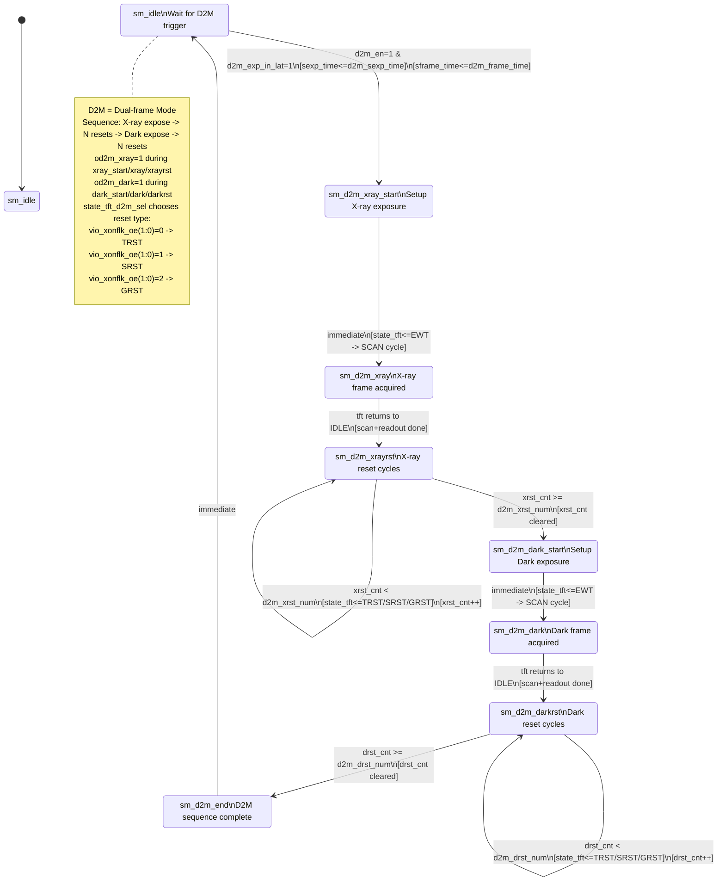
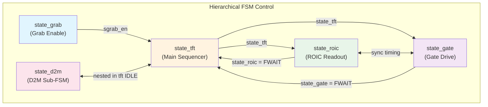

# TI_TFT_CTRL State Machines - Detailed Version
# Copy the mermaid code blocks below into https://mermaid.live to view diagrams

## 1. state_grab (Grab Control FSM)

```mermaid
stateDiagram-v2
    direction LR
    [*] --> s_IDLE

    state s_IDLE {
        direction LR
        note right of s_IDLE
            - sgrab_en = 0
            - sframe_cnt cleared when reg_grab_en=0
            - Ext Auto Reset: sExt_TimeRstCnt increments
            - RstFrCnt tracks reset frame count
        end note
    }

    state s_DATA {
        direction LR
        note right of s_DATA
            - sgrab_en = 1
            - RstFrCnt cleared
            - sframe_cnt increments on s_FINISH
        end note
    }

    state s_WAIT {
        direction LR
        note right of s_WAIT
            - Wait for grab disable
            - (currently unused, replaced by s_IDLE)
        end note
    }

    s_IDLE --> s_DATA : sgrab_en_tmp=1\n[sgrab_en<=1]
    s_DATA --> s_IDLE : tft=EWT & grab_en=0\n[grab stopped during exposure]
    s_DATA --> s_IDLE : tft=FINISH & frame_num=0 & grab_en_tmp=0\n[continuous mode, no more trigger]
    s_DATA --> s_IDLE : tft=FINISH & sframe_cnt>=frame_num+frame_val-1\n[finite frame count reached]
    s_DATA --> s_WAIT : (disabled path)
    s_WAIT --> s_IDLE : reg_grab_en=0
```

## 2. state_tft (TFT Main FSM)

```mermaid
stateDiagram-v2
    [*] --> s_IDLE

    state "s_IDLE (0)" as IDLE
    state "s_TRST (1)\nTotal Reset" as TRST
    state "s_SRST_EWT (A)\nSerial Reset Front Wait" as SRST_EWT
    state "s_SRST (2)\nSerial Reset Scan" as SRST
    state "s_EWT (3)\nExposure Wait" as EWT
    state "s_SCAN (4)\nFrame Scan" as SCAN
    state "s_FINISH (5)\nScan Complete" as FINISH
    state "s_GRST (6)\nGlobal Reset" as GRST
    state "s_RstFINISH (7)\nReset Complete" as RstFINISH
    state "s_ScanFrWait (8)\nScan Frame Wait" as ScanFrWait
    state "s_RstFrWait (9)\nReset Frame Wait" as RstFrWait

    IDLE --> IDLE : D2M mode, sm_idle, no trigger\n[continuous TRST/SRST/GRST cycle]

    state "D2M Mode Branch" as d2m_branch {
        direction LR
        note right of d2m_branch
            D2M mode (d2m_en=1):
            sm_idle + trigger -> sm_d2m_xray_start
            sm_d2m_xray_start -> EWT (xray scan)
            sm_d2m_xray -> sm_d2m_xrayrst -> TRST (N times)
            sm_d2m_dark_start -> EWT (dark scan)
            sm_d2m_dark -> sm_d2m_darkrst -> TRST (N times)
            sm_d2m_end -> sm_idle
        end note
    }

    IDLE --> EWT : D2M: xray_start or dark_start\n[sexp_time<=d2m_sexp_time]
    IDLE --> TRST : D2M: xrayrst/darkrst (rst_mode(0)=0)\nOR NO GRAB: rst_mode(0)=0\nOR first_rst + rst_mode(1)=0
    IDLE --> SRST_EWT : D2M: d2m_sel=SRST\nOR NO GRAB: rst_mode(0)=1\nOR first_rst + rst_mode(1)=1
    IDLE --> GRST : D2M: d2m_sel=GRST

    IDLE --> EWT : GRAB + Shutter Freerun + ext_trig=1\n[sexp_time<=sreg_sexp_time]
    IDLE --> EWT : GRAB + Global/Ext trigger mode\n[sexp_time<=sreg_sexp_time]
    IDLE --> SCAN : GRAB + Rolling (no shutter, no first_rst)\n[sexp_time<=sreg_exp_time]
    IDLE --> EWT : first_tft=1 & rst_mode(1)=1\n[first frame after total reset]
    IDLE --> SCAN : first_tft=1 & rst_mode(1)=0 & shutter=0\n[first rolling frame]

    IDLE --> IDLE : Global Ext1 + ExtRst_MODE=01\n[no reset, wait for trigger]
    IDLE --> TRST : Global Ext1 + ExtRst_MODE=00\n[normal ext reset]
    IDLE --> TRST : Global Ext1 + ExtRst_MODE=02 + timeout\n[timed auto reset]

    TRST --> IDLE : D2M: d2m_exp_in_lat=1 & gate=FWAIT\n[trigger during total reset]
    TRST --> IDLE : D2M: stft_cnt>=gate_rst_cycle\n[reset cycle done]
    TRST --> IDLE : first_rst=0: grab_en=1 & gate=FWAIT\n[set first_rst=1]
    TRST --> IDLE : first_rst=0: stft_cnt>=gate_rst_cycle\n[cycle timeout]
    TRST --> IDLE : first_rst=1: rst_cnt>=rst_num & gate=FWAIT\n[all resets done, set first_tft=1]
    TRST --> IDLE : first_rst=1: stft_cnt>=gate_rst_cycle\n[rst_cnt++]

    SRST_EWT --> SRST : req_align=1 OR stft_cnt>=sexp_time

    SRST --> RstFrWait : gate=FWAIT & roic=FWAIT

    EWT --> SCAN : stft_cnt>=sexp_time\n[exposure complete]
    EWT --> FINISH : grab_en=0\n[grab stopped]
    EWT --> FINISH : req_align=1\n[bcal fast align]
    EWT --> SCAN : D2M xray: d2m_exp_in1=0 OR timeout
    EWT --> SCAN : D2M dark: stft_cnt>=xexp_time
    EWT --> SCAN : Ext2: ext_trig=0 OR timeout

    SCAN --> ScanFrWait : roic=FWAIT & gate=FWAIT\n[readout complete]

    ScanFrWait --> FINISH : stft_cnt>=frame_time-2 OR frame_time=0\n[frame period met]
    ScanFrWait --> FINISH : req_align=1\n[bcal fast finish]

    RstFrWait --> RstFINISH : stft_cnt>=frame_time-2 OR frame_time=0
    RstFrWait --> RstFINISH : req_align=1

    FINISH --> IDLE : immediate\n[stft_cnt cleared]
    RstFINISH --> IDLE : immediate\n[stft_cnt cleared]

    GRST --> IDLE : gate=GRST_GEnd
```

## 3. state_roic (ROIC Readout FSM)



## 4. state_gate (Gate Drive FSM)

```mermaid
stateDiagram-v2
    [*] --> s_IDLE

    state "s_IDLE (0)" as IDLE
    state "s_DUMMY (1)\nSkip offset/dummy lines" as DUMMY
    state "s_READY (2)\nWait for ROIC timing" as READY
    state "s_DIO_CPV (3)\nDIO+CPV sequence (ch=0)" as DIO_CPV
    state "s_CPV (4)\nCPV only (ch>0)" as CPV
    state "s_XON (5)\nXON period (TRST)" as XON
    state "s_OE (6)\nOutput Enable" as OE
    state "s_XON_FLK (7)\nXON+FLK overlap" as XON_FLK
    state "s_FLK (8)\nFLK only" as FLK
    state "s_CHECK (9)\nLine/Channel check" as CHECK
    state "s_OE_READY (A)\nMulti-OE wait" as OE_READY
    state "s_LWAIT (B)\nLine Wait" as LWAIT
    state "s_FWAIT (C)\nFrame Wait" as FWAIT
    state "s_GRST_G (D)\nGlobal Reset Gate" as GRST_G
    state "s_GRST_GEnd (E)\nGlobal Reset End" as GRST_GEnd

    IDLE --> READY : tft=SCAN/SRST & offsetY aligned\n[sgate_num set by offsetY lookup]
    IDLE --> DIO_CPV : tft=SCAN/SRST & offsetY not aligned\n[dummy_en=1, dummy_num calculated]\n[sgate_dio(num)<=1]
    IDLE --> XON : tft=TRST\n[xon<=0, flk<=0, Total Reset path]
    IDLE --> GRST_G : tft=GRST\n[Global Reset path]

    state "--- Normal Scan Path ---" as scan_note

    READY --> DIO_CPV : roic=GATE_OPEN & ch_cnt=0\n[first channel: DIO+CPV]\n[sgate_dio(num)<=1]
    READY --> CPV : roic=GATE_OPEN & ch_cnt>0\n[subsequent channels: CPV only]\n[sgate_cpv<=1]

    state DIO_CPV {
        direction LR
        note right of DIO_CPV
            Sub-FSM (state_cpv):
            0: cpv<=1, oe<=1(if not dummy)
            1: cnt>=cpv1_cpv2 -> cpv<=0, dio<=0
               -> if dummy: phase2
               -> if multi-OE: phase3
               -> else: go OE
            2: cnt>=cpv2_dio2 -> dio<=0
               -> phase3 or OE
            3: cnt>=dio2_cpv1
               -> if dummy: go DUMMY (advance ch)
               -> else: go OE
        end note
    }

    DIO_CPV --> OE : CPV sequence done (no dummy)
    DIO_CPV --> DUMMY : CPV done + dummy_en=1\n[ch_cnt/sgate_num advance]

    state CPV {
        direction LR
        note right of CPV
            Sub-FSM (state_cpv):
            0: cnt >= CPV_PERIOD/2 -> cpv<=0
               -> if dummy/multi-OE: phase1
               -> else: go OE
            1: cnt >= CPV_PERIOD
               -> if dummy: go DUMMY (advance ch)
               -> else: go OE
        end note
    }

    CPV --> OE : CPV done (no dummy)
    CPV --> DUMMY : CPV done + dummy_en=1\n[ch_cnt/sgate_num advance]

    DUMMY --> DIO_CPV : more dummy lines & ch_cnt=0\n[sgate_dio(num)<=1]
    DUMMY --> CPV : more dummy lines & ch_cnt>0\n[sgate_cpv<=1]
    DUMMY --> READY : dummy count reached & end=0\n[dummy complete, start real scan]
    DUMMY --> FWAIT : dummy count reached & end=1\n[tail dummy done, frame complete]

    OE --> CHECK : sgate_cnt >= gate_oe - 1\n[OE period done]\n[oe<=0 if oe_cnt=oe_num-1]

    CHECK --> FWAIT : SCAN/SRST & line_cnt>=height & last_oe & last_ch\n[frame complete]
    CHECK --> LWAIT : SCAN/SRST & line_cnt>=height & last_oe & !last_ch\n[end=1, tail dummy needed]
    CHECK --> LWAIT : SCAN/SRST & !last_oe_group\n[line_cnt += DUAL_BY_MODEL]
    CHECK --> OE_READY : !last_oe (multi-OE binn mode)\n[oe_cnt++]
    CHECK --> FWAIT : tft=TRST\n[reset scan done]

    OE_READY --> DIO_CPV : ch_cnt=0\n[sgate_dio(num)<=1, oe<=1]
    OE_READY --> CPV : ch_cnt>0\n[sgate_cpv<=1, oe<=1]

    LWAIT --> READY : roic=DUMMY & dummy_en=0\n[wait for next ROIC line]
    LWAIT --> CPV : roic=DUMMY & dummy_en=1\n[dummy gate drive]

    state "--- Total Reset Path ---" as trst_note

    XON --> XON_FLK : cnt >= gate_xon - gate_xon_flk\n[flk<=1, overlap start]
    XON_FLK --> FLK : cnt >= gate_xon\n[xon<=1 (deassert)]
    FLK --> CHECK : cnt >= gate_xon + gate_flk\n[flk<=0]

    state "--- Global Reset Path ---" as grst_note

    GRST_G --> GRST_GEnd : H/V counters complete\n[dio/cpv/oe driven by VIO timing]
    GRST_GEnd --> IDLE : immediate\n[all signals cleared]

    FWAIT --> IDLE : tft=IDLE\n[all counters/signals reset]

    note right of CHECK
        ch_cnt/sgate_num advance logic:
        if sgate_num < GATE_NUM/DUAL - 1
           AND ch_cnt >= GATE_CH - dummy_add - 1:
            ch_cnt = 0, sgate_num++
        else:
            ch_cnt += dummy_add + 1

        img_mode determines:
        - sgate_dummy_add (0 or 1)
        - sgate_oe_num (1, 2, or 3)
    end note
```

## 5. state_d2m (D2M Sub-FSM)



## FSM Interaction Overview


