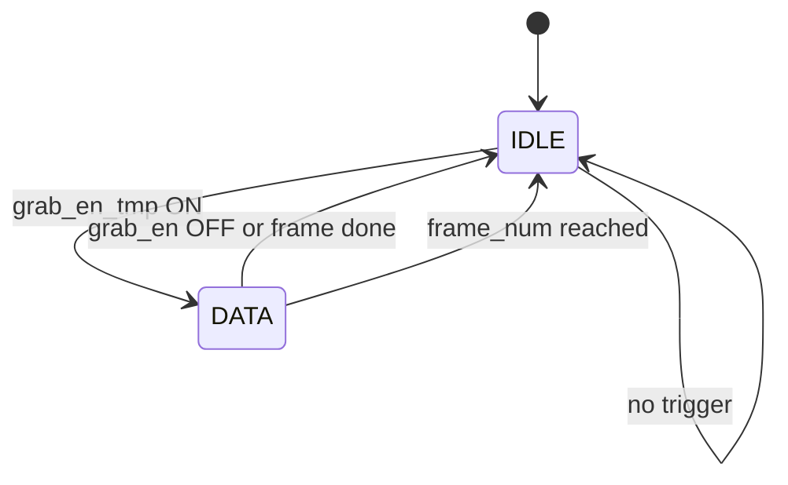
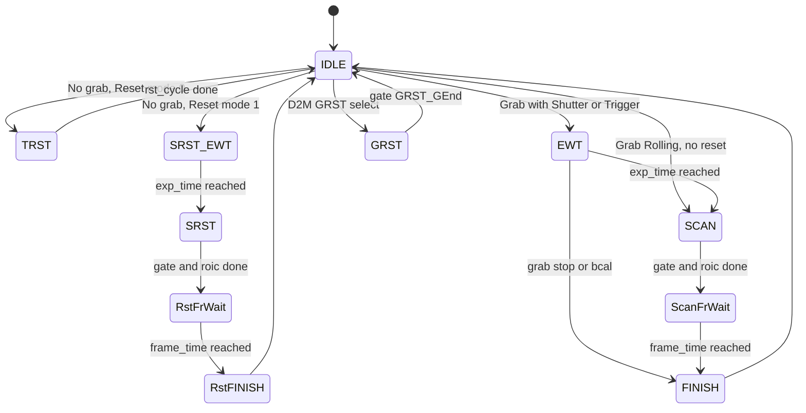
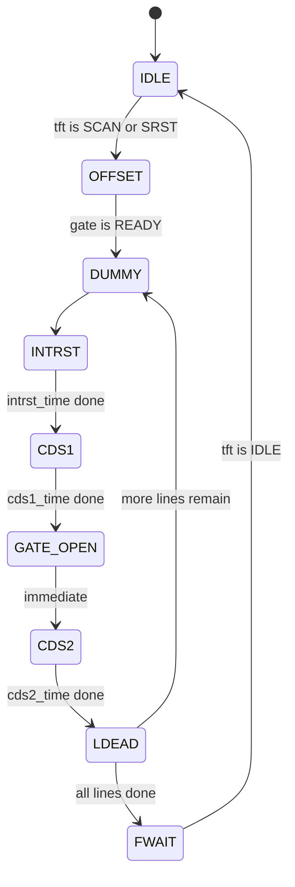
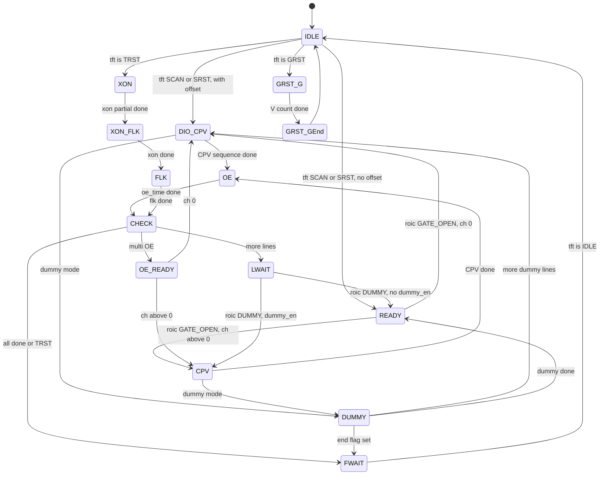
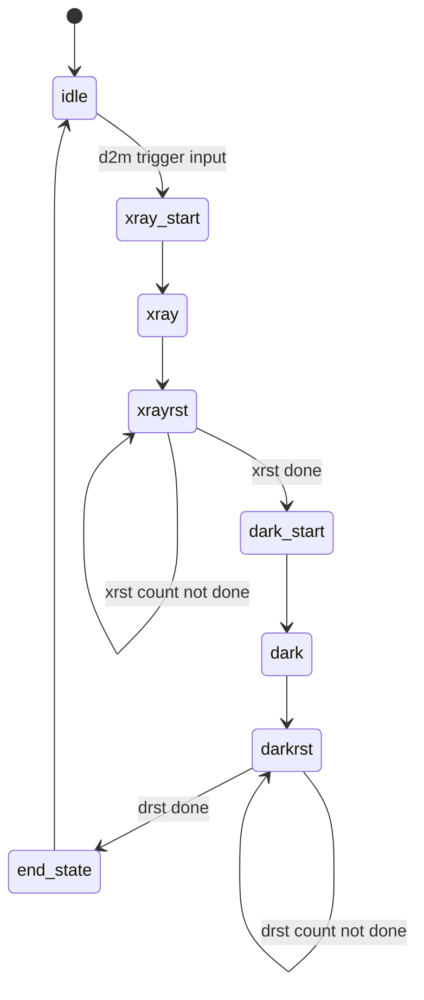

# TI_TFT_CTRL State Machines - Simple Version
# Copy the mermaid code blocks below into https://mermaid.live to view diagrams

## 1. state_grab - Grab Control FSM

## 2. state_tft - TFT Main FSM

## 3. state_roic - ROIC Readout FSM

## 4. state_gate - Gate Drive FSM

## 5. state_d2m - D2M Sub FSM, inside state_tft

